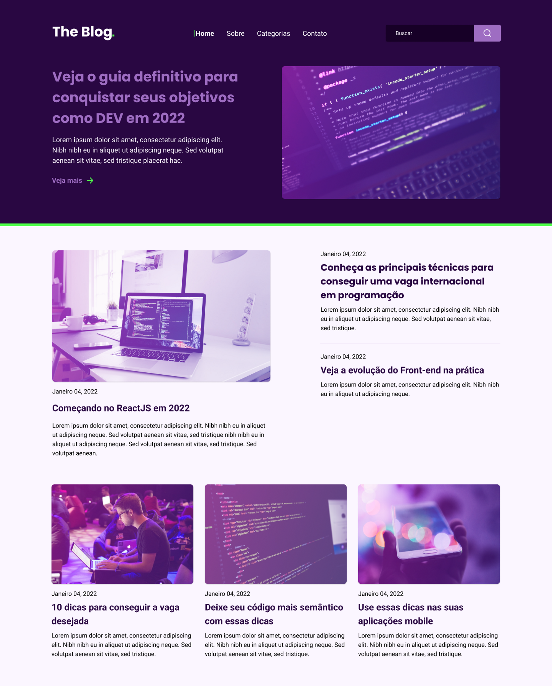

<h1 align="center"> Rocketblog </h1>
 

  

## 💻 Projeto

Neste desafio você irá desenvolver uma homepage para um blog.

## 🚀 Tecnologias

Esse projeto foi desenvolvido com as seguintes tecnologias:

- HTML e CSS
- Git e Github
- Figma
